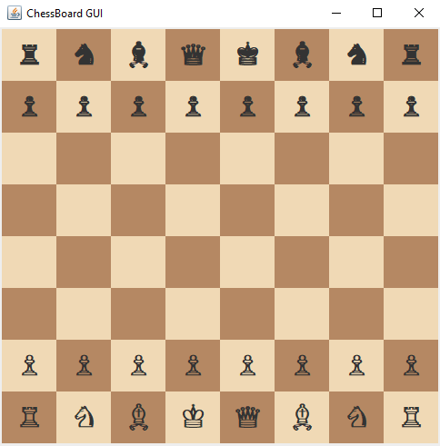

# GUI Chess Game Project

This project is a GUI-based Chess game developed as part of TXST Object-Oriented Programming course. It combines backend logic with a graphical interface built over the course of three phases, creating a complete chess game experience with full gameplay functionality.

# CS 3354: Object-Oriented Design and Programming
  Fall 2025 Section R01 

# Team Name: ChessTeam4

Team Members:
  Corbin, 
  Josh,
  En
  
### Preview:

### Class Diagram:

### Instructions for how to compile, start, and run the chess game

Follow these instructions to compile and run the project:
  1. Clone the Respository: git clone [http.....]
  2. Compile the Code: javac........
  3. Run the Game: java......

### Features Checklist
- [ ] GUI with an 8x8 ChessBoard
- [ ] Piece Movement with Mouse Interaction
- [ ] Move Validation Based on Chess rule
- [ ] Capture Mechanism
- [ ] Check and Checkmate Detection
- [ ] Turn-Based Play for Two Players
- [ ] Game End Notification on Checkmate

## Additional Information
For details on Phases 1 and 2, please refer to "group/PH1" and "group/ph2" for their implementations. Detailed documentation for those phases is not included in this README.

## Acknoledgements
Special thanks to Dr. Xiaomin Li and our team members for their support and collaboration.

